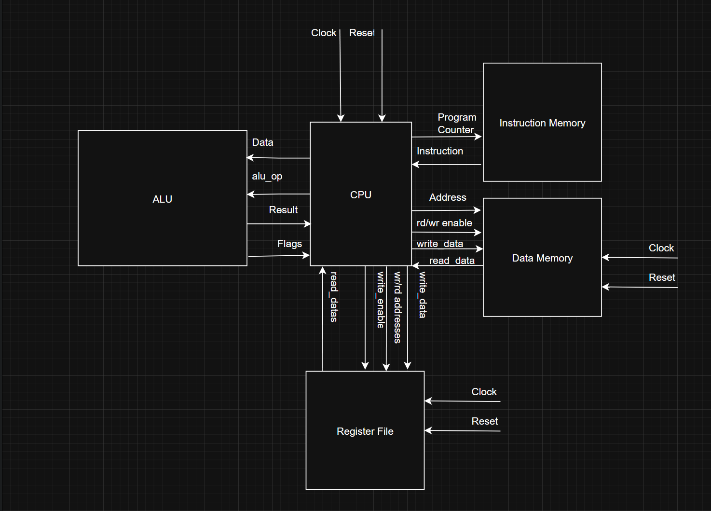
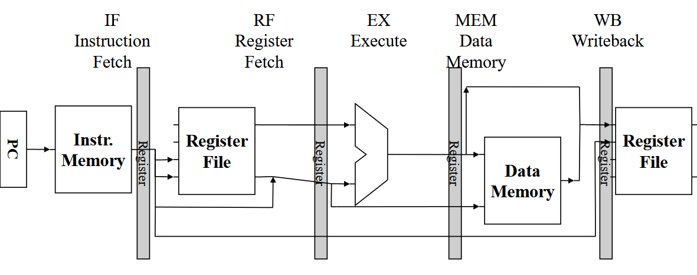

# Gate-Level ARM Subset CPU Implementation

## Table of Contents
- [Overview](#overview)
- [Specifications](#specifications)
- [Architecture](#architecture)
- [Pipeline Design](#pipeline-design)
- [Modules](#modules)
- [Forwarding and Hazard Handling](#forwarding-and-hazard-handling)
- [Instruction Set](#instruction-set)
- [Testing](#testing)
- [Integration with Peripherals](#integration-with-peripherals)
- [Known Issues and Limitations](#known-issues-and-limitations)
- [Future Work](#future-work)
- [Build and Simulation](#build-and-simulation)
- [Appendices](#appendices)

---

## Overview
A five-stage pipelined processor implementing an 11-instruction subset of the ARMv8-A architecture. This project largely was completed without using built-in arithmetic or memory constructs—every component, including adders and multiplexers, was constructed at the gate level. The exceptions to this are instruction decoding in CPU.sv, and datamem and instructmem, which use always_comb blocks. 

## Specifications
- **ISA**: Subset of ARMv8-A
- **Pipeline stages**: IF, ID/RF, EX, MEM, WB
- **Instruction count**: 11
- **Technology**: SystemVerilog, gate-level modules
- **Testing**: Self-contained simulation framework with test programs, modelsim

## Architecture
### High-level block diagram

### Datapath and Control Flow

The CPU follows a classic five-stage pipelined datapath. The stages are:

1. **Instruction Fetch (IF)**  
   The Program Counter (PC) selects the current instruction address, which is used to fetch an instruction from instruction memory. PC is incremented every cycle unless a branch condition overrides it.

2. **Register Fetch (RF)**  
   The fetched instruction is decoded. Source register addresses are used to read from the register file. Immediate values are sign-extended if needed. Control signals are generated for the rest of the pipeline based on the instruction opcode and function bits. Branch logic for B.LT and B is determined.

3. **Execute (EX)**  
   The ALU performs the arithmetic or logical operation using operands from the RF stage. This stage handles CBZ target calculation as well.

4. **Memory Access (MEM)**  
   For load and store instructions, this stage accesses data memory. It also includes data forwarding and control hazard resolution. All store operations and conditional branches are resolved here. Load instructions forward the data to WB.

5. **Write Back (WB)**  
   The result from the ALU or memory is written back to the register file. A mux controlled by the `read_mem` signal determines the source of the writeback data.

### Control Flow

Control signals are generated in the RF stage and propagate down the pipeline. Forwarding logic prevents data hazards by dynamically selecting between register file data, MEM results, or WB results using multiplexers. Branch control flow is managed in the EX and MEM stages, allowing for early PC redirection when needed.

The entire pipeline is synchronized on a positive-edge clock. Reset initializes all pipeline registers and control paths. Bubble insertion (NOP injection) is used when hazards require it, and a global stall signal halts instruction fetch to maintain pipeline correctness.

## Pipeline Design

### Registers Between Stages
Pipeline registers are placed between each stage to hold the relevant control signals and data:
- **IF/ID:** Holds the fetched instruction and PC.
- **ID/EX:** Holds register values, immediate values, and control signals.
- **EX/MEM:** Holds ALU output and destination register ID.
- **MEM/WB:** Holds memory read data or ALU output and destination register ID.
  

## Source Modules

### `adder.sv`
A parameterized width adder module made from full adders.
- Inputs: `A`, `B`
- Outputs: `sum`, `carry_out`, `overflow`
- implements: full_adder

### `alu.sv`
Performs arithmetic operations using gate-level logic. 
Can perform bypass, addition, subtraction, and bitwise AND, OR, or XOR depending on the operation dictated by `cntrl`.
- Inputs: `A`, `B`, `cntrl`
- Outputs: `result`, `zero`, `negative`, `carry_out`, `overflow`
- implements: adder, inverter, mux2_1, bitwise_and, bitwise_or, bitwise_xor

### `bitwise_and.sv`
A parameterized width bitwise AND gate.
- Inputs: `A`, `B`
- Outputs: `out`
- implements: none

### `bitwise_or.sv`
A parameterized width bitwise OR gate.
- Inputs: `A`, `B`
- Outputs: `out`
- implements: none

### `bitwise_xor.sv`
A parameterized width bitwise XOR gate.
- Inputs: `A`, `B`
- Outputs: `out`
- implements: none

### `d_flipflop.sv`
A D type flipflop with parameterized reset behavior. Built from the gate level, modeled after the 74LS74.
- Inputs: `d`, `reset`, `clock`
- Outputs: `q`
- implements: none

### `datamem.sv`
RAM module for data storage. This module was provided as part of my EE469 class, and is not implemented from the gate level.
Has parameterized size and uses little-endian encoding.
- Inputs: `address`, `write_enable`, `read_enable`, `write_data`, `clk`, `xfer_size`
- Outputs: `read_data`
- implements: none

### `decoder.sv`
A width-parameterized decoder module which recursively instantiates smaller decoders. 
- Inputs: `enable`, `in`
- Outputs: `out`
- implements: itself

### `dff_with_enable.sv`
A d-flip flop with reset and enable functionality
- Inputs: `clk`, `in`, `enable`, `reset`
- Outputs: `out`
- implements: d_flipflop

### `equality_checker.sv`
A module which checks if two five-bit inputs are equal, and outputs 1 only if they are.
Cleaner implementations are possible than this one, but my original project requirements were no gates with more than 4 inputs.
I may rewrite this module to be width scalable and utilize an appropriate number of AND gates later.
- Inputs: `in0`, `in1`
- Outputs: `out`
- implements: none

### `full_adder.sv`
A standard implementation of a full adder.
- Inputs: `A`, `B`, `c_in`
- Outputs: `c_out`, `sum`
- implements: none

### `instructmem.sv`
This is the instruction memory - it reads and stores a .arm file in a way the CPU can read. This was provided as part of my EE469 class, so it isn't written from the gate level.
- Inputs: `address`, `clk`
	*Note: the clock is only used for error checking through assert statements.
- Outputs: `instruction`
- implements: none

### `inverter.sv`
This is a parameterized-width inverter module which inverts the bits by notting them and then adding one, making them the negative version of the same number for signed operations.
- Inputs: `in`
- Outputs: `out`
- implements: full_adder

### `linear_shift_left.sv`
This is a parameterized-width shift-left module. It shifts by an amount determined by the SHIFT parameter.
- Inputs: `in`, `enable`
- Outputs: `out`
- implements: mux2_1

### `linear_shift_right.sv`
This is a parameterized-width shift-right module. It shifts by an amount determined by the SHIFT parameter.
- Inputs: `in`, `enable`
- Outputs: `out`
- implements: mux2_1

### `linear_shift_right_dynamic.sv`
This is a 64 bit shift-right module. It uses cascaded linear_shift_right modules to dynamically shift the output based on the current value of shift_amount.
- Inputs: `in`, `shift_amount`
- Outputs: `out`
- implements: linear_shift_right

### `mux_recursive.sv`
This is a parameterized-width multiplexor which instantiates itself using smaller multiplexors.
- Inputs: `in`, `read`
- Outputs: `out`
- implements: itself, mux2_1

### `mux2_1.sv`
This is a simple two to one multiplexor.
- Inputs: `i0`, `i1`, `sel`
- Outputs: `out`
- implements: none

### `register.sv`
This is a register with parameterized width and reset behavior, as well as an enable.
- Inputs: `in`, `clk`, `enable`, `reset`
- Outputs: `out`
- implements: dff_with_enable

### `register_file.sv`
This file contains 32 registers, including a special 0-locked register X31. It support simultaneous read and write operations and has two read ports.
- Inputs: `clk`, `write_enable`, `reset`, `write_addr`, `read_addr1`, `read_addr_2`, `reset`
- Outputs: `read_data_1`, `read_data_2`
- implements: decoder, register, mux_recursive

### `sign_extend.sv`
This module is parameterized-width and extends a value with respect to the sign of the input.
- Inputs: `in`, `is_signed`
- Outputs: `out`
- implements: mux2_1

### `zero_checker.sv`
This module is a parameterized-width zero checker which outputs 1 when all the inputs are 0.
- Inputs: `in`
- Outputs: `out`
- implements: none

## Forwarding and Hazard Handling

### Overview of Forwarding Paths
This CPU implementation includes basic forwarding logic to mitigate data hazards in the pipeline. The forwarding unit supports bypassing results from the memory (MEM) and write-back (WB) stages back to the execute (EX) or register fetch (RF) stages. Specifically, the CPU can forward:
- ALU results from MEM/WB to EX for dependent arithmetic operations.
- Load results from WB to EX, with special consideration to ensure values are valid only after the memory stage completes.

### Logic for Detecting and Resolving Hazards
Hazards are detected by comparing destination registers of instructions in later stages with source registers of the current instruction in EX or RF. If a match is found and the write enable signal is active, the forwarding paths are activated accordingly. For load-use hazards (where the value being loaded hasn't completed memory access), a stall is inserted.

### Stall and NOP Insertion
Stalls are implemented by holding PC and IF/ID pipeline registers and injecting a NOP into the decode stage. This occurs specifically for load-use hazards when a value is not yet ready. Branch instructions insert NOPs by default after branching to prevent issues with pipeline flush.

---

## Instruction Set

| Mnemonic | Operation              | Description                      |
|----------|------------------------|----------------------------------|
| ADDI     | Add Immediate           | `Rd = Rn + imm`                  |
| SUBS     | Subtract and Set Flags  | `Rd = Rn - Rm`                   |
| ADDS     | Add and Set Flags       | `Rd = Rn + Rm`                   |
| AND      | Bitwise AND operation   | `Rd = Rn & Rm`                   |
| EOR      | Bitwise XOR operation   | `Rd = Rn ^ Rm`                   |
| LDUR     | Load                    | `Rt = Mem[Rn + imm]`             |
| STUR     | Store                   | `Mem[Rn + imm] = Rt`             |
| B        | Unconditional Branch    | `PC = PC + imm`                  |
| CBZ      | Compare, Branch if Zero | `if (Rt == 0) PC = PC + imm`     |
| BLT      | Branch if Less Than     | `if (N && !Z) PC = PC + imm`     |

---

## Testing

### Description of Testbench Setup
The testbench initializes the CPU and provides clock and reset signals. It loads binary programs into instruction memory and simulates execution across multiple clock cycles. Internal state such as register file contents and memory values are observed using waveform viewers.

### Sample Programs and Expected Register States
Test programs include arithmetic sequences, branching scenarios, and memory access patterns. For instance:
- A pipelining test that ensures the pipelining logic is correct in a variety of scenarios
- An implementation of Bubble Sort

These programs all have the expected outputs in instruction memory and in the test file itself. Some of the tests have a value differing between pipelined and nonpipelined processors - the expected value for this processor is the *non-pipelined* value. This is because the inital project requirements didn't have flushing as a requirement.

### How Hazards and Edge Cases Were Verified
Each test case was written to explicitly trigger known hazard scenarios, including:
- Arithmetic dependencies across adjacent instructions
- Load followed immediately by a dependent arithmetic operation
- Branch decisions taken with delay slots
Waveform analysis confirmed correct pipeline behavior and data integrity.

---

## Known Issues and Limitations
- No support for exceptions or interrupts.
- No floating-point instructions or co-processors.
- Branch delay slots are handled via NOP insertion rather than dynamic resolution.
- Only a minimal subset of the ARMv8 instruction set is implemented.

---

## Future Work
I may expand on this project at a later time with the following:
- Expand ISA to include shift and multiply operations.
- Add support for interrupt handling and exception vectors.
- Integrate a VGA display module using memory-mapped IO and a custom DISP instruction.

---

## Build and Simulation

### Required Tools
- Modelsim

### How to Compile and Run Tests
1. Write the test program in binary.
2. Place the test program in the benchmarks folder and set instruction memory's BENCHMARK variable.
3. Run the simulation: `do runlab.do` in modelsim.
4. View the output waveform.

### Expected Output Waveforms
Waveform outputs include:
- Clock and reset signals
- Pipeline register values
- Register file changes
These are used to verify that control and datapath modules operate correctly over time.

---

## Appendices

### Full ISA Encoding Table
| Mnemonic | Format  | Opcode (Binary)        | Description                        |
|----------|---------|------------------------|------------------------------------|
| ADDI     | I-type  | 1001000100xxxxx        | `Rd = Rn + imm`                    |
| SUBS     | R-type  | 11101011000xxxxx       | `Rd = Rn - Rm` + flags             |
| ADDS     | R-type  | 10101011000xxxxx       | `Rd = Rn + Rm` + flags             |
| AND      | R-type  | 10001010000xxxxx       | `Rd = Rn & Rm`                     |
| EOR      | R-type  | 11001010000xxxxx       | `Rd = Rn ^ Rm`                     |
| LDUR     | D-type  | 11111000010xxxxx       | `Rt = Mem[Rn + imm]`               |
| STUR     | D-type  | 11111000000xxxxx       | `Mem[Rn + imm] = Rt`               |
| B        | B-type  | 000101xxxxxxxxxx       | `PC = PC + imm`                    |
| CBZ      | CB-type | 10110100xxxxxxxx       | `if (Rt == 0) PC = PC + imm`       |
| BLT      | CB-type | 01010100xxxxxxxx       | `if (N && !Z) PC = PC + imm`       |

*Note: Encoding bits shown are partial for brevity; full instruction encoding includes register fields and immediate values as per instruction format.*

### Timing Diagrams
Includes:
- Pipeline progression for sequential instructions
- Forwarding and stall events
- Memory access timing
